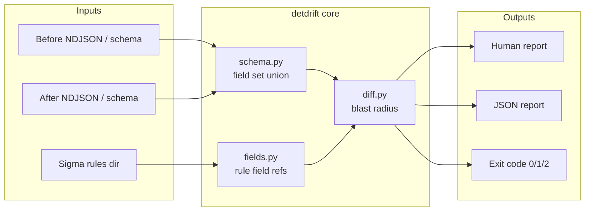

# Architecture

## Purpose

`detdrift` answers one question in CI and on a laptop:

> If this telemetry schema changes, which Sigma detections go silent?

It is a **schema → detection blast-radius** analyzer. It is not a SIEM, not a Sigma matcher, and not a data pipeline.

## Design principles

1. **One job** — field-presence blast radius. Refuse feature creep into matching, enrichment, or storage.
2. **Offline by default** — no network calls; only local rules and samples.
3. **CI-native** — exit `0` / `1` / `2` are part of the contract.
4. **Honest scope** — "SAFE" means referenced fields still exist, not that the rule will fire.
5. **Complementary** — sits beside tools like [local-mcp-toolbox](https://github.com/chriswayneh/local-mcp-toolbox) (agent inspection) without owning agent runtime or SIEM ingest.

## Context



## Components

| Module | Responsibility |
|--------|----------------|
| `cli.py` | Typer surface: `diff`, `fields`, `init` |
| `schema.py` | Build a field-path set from NDJSON/JSONL (file or directory) |
| `fields.py` | Walk Sigma `detection` selections; strip `|modifiers`; collect field paths |
| `diff.py` | For each rule: referenced ∩ (before − after) → IMPACTED |
| samples | `fixtures/before`, `fixtures/after`, `rules/` — reproducible demo |
| CI | `.github/workflows/detdrift.yml` — pytest + intentional exit-code checks |

## Data flow (`detdrift diff`)

1. Load **before** schema = union of event field paths.
2. Load **after** schema the same way.
3. Discover Sigma YAML under `--rules`.
4. For each rule, extract referenced fields from `detection` (ignore `condition` semantics in v0.1).
5. Mark IMPACTED when any referenced field is present in before and absent in after.
6. Emit report; exit `1` if any IMPACTED, `2` on I/O/parse errors, else `0`.

## Schema model (v0.1)

- Top-level keys on each event object.
- One level of dotted paths for nested objects (`parent.image`).
- Arrays do not expand element schemas in v0.1.
- Field sets are case-sensitive (Sigma field names as written).

## Rule model (v0.1)

- Single-document Sigma YAML.
- Selection keys like `CommandLine|contains` → field `CommandLine`.
- Keyword-only detections (no field keys) produce no field refs and cannot be IMPACTED by schema loss — documented limitation.
- No evaluation of `condition`, timeframes, or correlations.

## Trust and security

- Treat fixtures and rule files as **untrusted input** (YAML parse only; no code execution).
- No subprocess calls to external scanners in the core path.
- No credentials, no cloud APIs in v0.1.
- Optional future AI propose-patch (Phase 2) must be opt-in and never auto-apply.

## Extension points (intentional)

| Hook | Future use | Guardrail |
|------|------------|-----------|
| Schema providers | SIEM export, OCSF parquet sample, pipeline dry-run output | Still offline snapshots; no live SIEM required for core |
| Rule providers | KQL / SPL / custom YAML | Same blast-radius contract |
| Reporters | SARIF, GitHub Check annotations | Exit codes stay stable |
| Propose-patch | LLM drafts mapping or rule fixes | Human merge only |

## Non-goals (architecture freeze)

- Full Sigma compilation or backends
- Live federation across SIEM / lake / SaaS
- Owning ingest, routing, or storage
- Replacing detection-as-code test frameworks that evaluate match/no-match on fixtures

Those may appear as **sibling** tools; they do not expand this binary's core path without a major version and roadmap change.

## Package layout

```text
src/detdrift/     library + CLI
rules/            demo Sigma
fixtures/         before/after NDJSON
tests/            unit tests
examples/         demo.sh
.github/workflows CI contract
```

## Versioning

- **0.x** — MVP and hardening; CLI flags may evolve with changelog notes.
- **1.0** — stable exit codes, schema/field extraction contract, documented Sigma subset.
