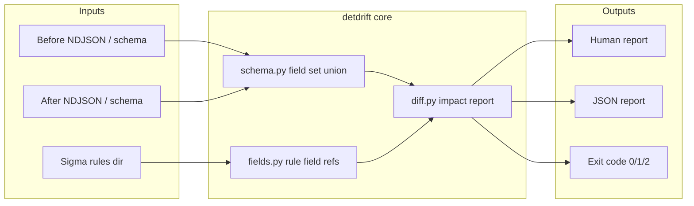

# Architecture

## Purpose

detdrift answers one question, locally or in CI:

> If this telemetry schema changes, which Sigma detections go quiet?

It compares field sets before and after a change against the fields your Sigma rules name. It is not a SIEM, not a Sigma matcher, and not a data pipeline.

## Design principles

1. **One job.** Report which rules lose fields they depend on. Do not grow into matching, enrichment, or storage.
2. **Offline by default.** No network calls. Only local rules and samples.
3. **Clear exit codes.** `0` / `1` / `2` are part of the interface for CI.
4. **Honest results.** "SAFE" only means the referenced fields still exist. It does not mean the rule will fire.
5. **Separate from other tools.** Works alongside [local-mcp-toolbox](https://github.com/chriswayneh/local-mcp-toolbox). It does not own agent runtime or SIEM ingest.

## Context



## Components

| Module | Role |
|--------|------|
| `cli.py` | Commands: `diff`, `fields`, `init` |
| `schema.py` | Build a field-path set from NDJSON/JSONL (file or directory) |
| `fields.py` | Walk Sigma `detection` selections, strip `|modifiers`, collect field paths |
| `diff.py` | Mark IMPACTED when a referenced field is in before and missing from after; recursive discovery; fail-on helpers |
| samples | `fixtures/before`, `fixtures/after`, `rules/` for the demo |
| CI | `.github/workflows/detdrift.yml` runs pytest and exit-code checks |
| Action | Root `action.yml` composite action for external repos |
| JSON | `docs/json-report.md` documents `schema_version` |

## Data flow (`detdrift diff`)

1. Load the before schema as the union of event field paths.
2. Load the after schema the same way.
3. Recursively find Sigma YAML under `--rules` (skipping `.git`, `.github`, `vendor`, `tests`, and similar).
4. For each rule, extract referenced fields from `detection` (still ignores `condition` logic).
5. Mark IMPACTED when any referenced field is present before and absent after.
6. Print the report. Exit `1` if any rule is IMPACTED (or if a `--fail-on-*` filter matches), `2` on I/O or parse errors, otherwise `0`.

## Schema model (v0.1)

- Top-level keys on each event object.
- One level of dotted paths for nested objects (`parent.image`).
- Arrays do not expand element schemas in v0.1.
- Field names are case-sensitive, as written in Sigma.

## Rule model (v0.1)

- Single-document Sigma YAML.
- Selection keys like `CommandLine|contains` map to field `CommandLine`.
- Keyword-only detections (no field keys) produce no references, so they cannot be IMPACTED by a missing field. That is a known limit.
- No evaluation of `condition`, timeframes, or correlations.

## Trust and security

- Treat fixtures and rule files as untrusted input. Parse YAML only. Do not execute code from them.
- The core path does not call external scanners.
- v0.1 uses no credentials and no cloud APIs.
- A later optional propose-patch helper (Phase 2) must stay optional and must never auto-apply changes.

## Possible extensions later

| Hook | Possible use | Guardrail |
|------|--------------|-----------|
| Schema providers | SIEM export, parquet sample, pipeline dry-run output | Still offline snapshots. Core does not require a live SIEM. |
| Rule providers | KQL, SPL, or custom YAML | Same impact report contract |
| Reporters | SARIF, GitHub Check annotations | Keep exit codes stable |
| Propose-patch | Draft mapping or rule fixes for review | Human merge only |

## Non-goals

- Full Sigma compilation or backends
- Live search across SIEM, lake, or SaaS
- Owning ingest, routing, or storage
- Replacing tools that evaluate match / no-match on fixtures

Those can live as other projects. They should not expand this tool's core path without a major version and a roadmap change.

## Layout

```text
src/detdrift/     library and CLI
rules/            demo Sigma
fixtures/         before/after NDJSON
tests/            unit tests
examples/         demo.sh
docs/             JSON report contract and CI copies
action.yml        reusable composite GitHub Action
.github/workflows CI
```

## Versioning

- **0.x:** early releases. CLI flags may change; note them in the changelog.
- **1.0:** stable exit codes, stable schema/field extraction contract, documented Sigma subset.
